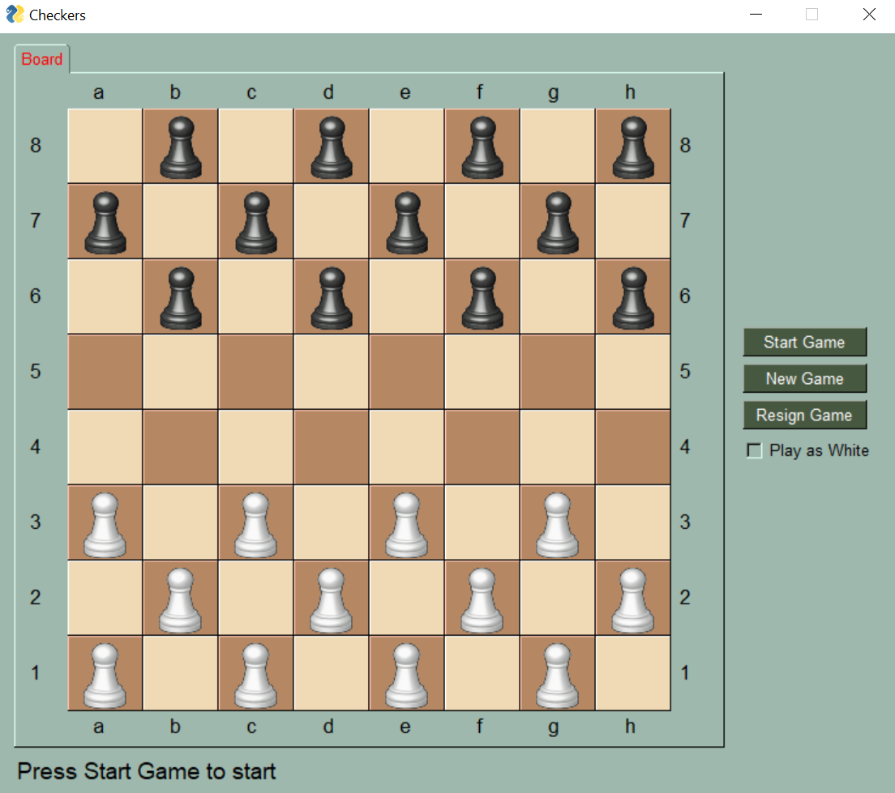

# Checkers AI with Minimax alpha-beta pruning

## Getting Started

These instructions will get you a copy of the project up and running on your local machine for development and testing purposes.

### Prerequisites

To run it you will need the following dependencies:

```
import os
import copy
import math
import PySimpleGUI
```

### Installing

To clone the repository execute the following command:

```
git clone git@github.com:Alvaro2112/Checkers-AI.git
```

## Running the Game

To play the game simply Run:

```
python Game.py 
```

If you wish, you can play around with the parameters to change the game mode, these parameters are situated 
in the Game.py file:

```
player : Who you will be, either black (-1) or white (1)                                
depth : The depth of the algorith in 1 player mode, be cautious as too much depth might crash your computer
bot_vs_bot : Set this to true if you want two AI's to go against each other                                               
depth_white_bot : The depth of the algorithm for the white pieces if bot_vs_bot is enabled                  
depth_black_bot : The depth of the algorithm for the black pieces if bot_vs_bot is enabled                                        
```


### Interface




When starting the game you will see this Interface, you will play as black by default 
but you can change that by ticking the "Play as White" box before starting the game.

The other buttons are self explanatory.

### What to expect

The AI was implemented using the minimax algorithm and was optimized using the alpha-beta pruning method, on my laptop I 
have been able to run it on a depth of up to 8, more than that and it would take a long time for it to play.

The reward function for the agent is quite basic and can be modified in the Board.py file in the board_score() function. Using this reward
function it has been capable of beating most mid-range players it has played against, but it can easily get stuck in a loop
towards the end, and I am not able to overcome this with a depth of 8. I would assume that this could be avoided with higher depths.

As for the AI vs AI mode it can be fun to play with, but because the algorithm is deterministic you will always have the same outcome
for two specific depths.

## Built With

* [OpenAI Gym](https://gym.openai.com/) - Environmnet used to train the Agent

## Authors

* **Alvaro Caudéran**
